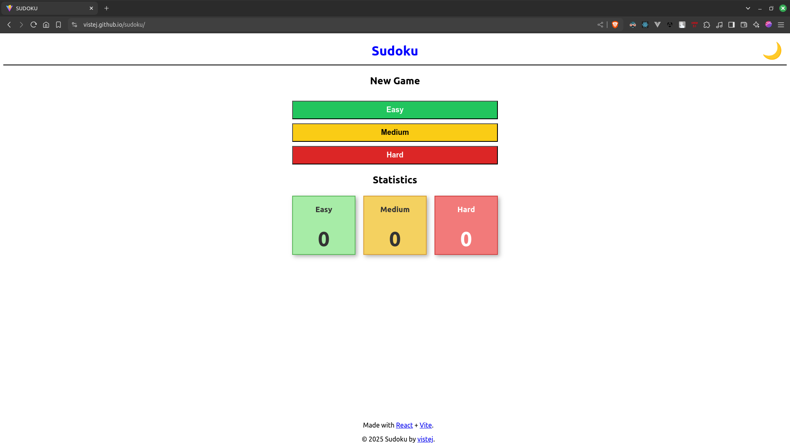
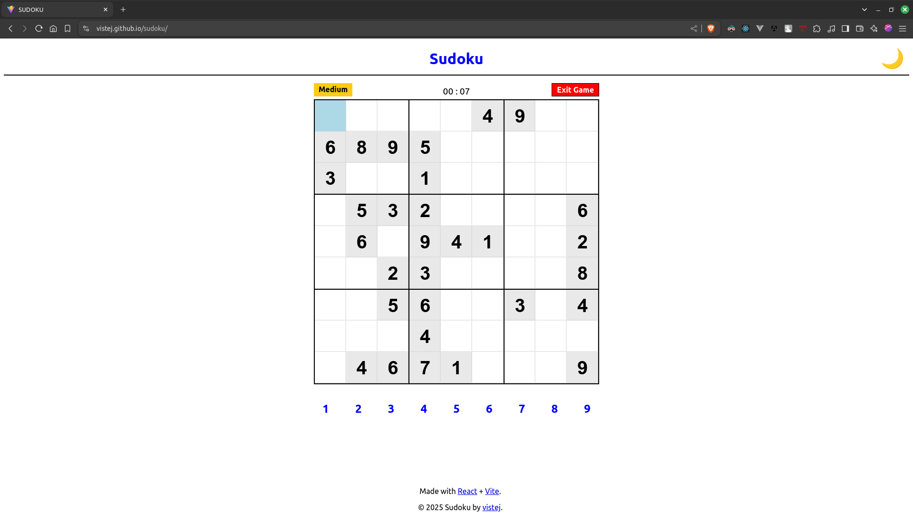
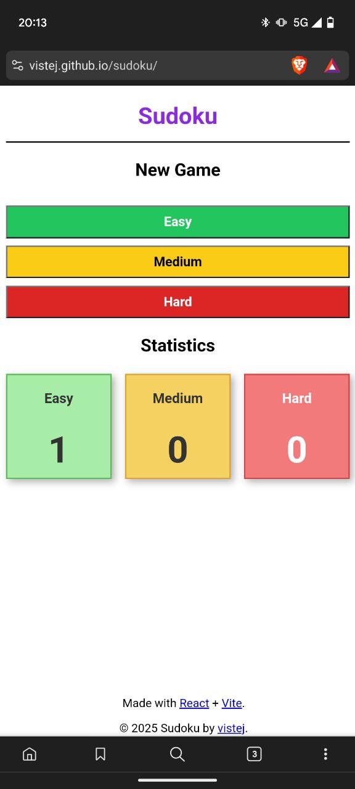
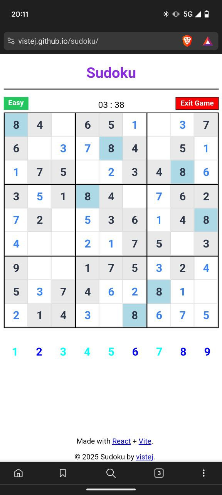
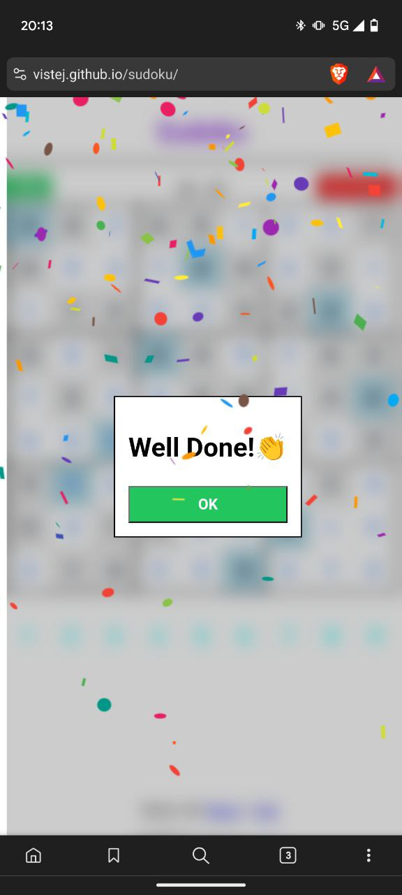

# Sudoku Game

A Sudoku game built with React. [Open Game](https://vistej.github.io/sudoku/)


## Features

- Playable Sudoku game with dynamic puzzle generation
- Three difficulty levels: Easy, Medium, Hard
- Dark mode support
- Responsive and user-friendly interface

## Technologies Used

- React
- TypeScript
- CSS (for styling)

## Installation

1. Clone the repository:
   ```sh
   https://github.com/vistej/sudoku.git
   ```
2. Navigate to the project directory:
   ```sh
   cd sudoku-game
   ```
3. Install dependencies:
   ```sh
   npm install
   # or
   yarn install
   # or
   pnpm install
   ```

## Running the Game

To start the development server:
```sh
npm run dev
# or
yarn dev
# or
pnpm dev
```
Then open [http://localhost:5173](http://localhost:5173) (or the displayed port) in your browser.

## Build for Production

To build the project for production:
```sh
npm run build
# or
yarn build
# or
pnpm build
```
## Screenshots









