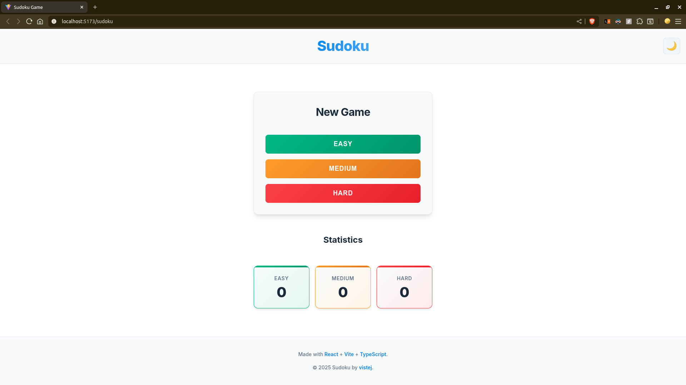

# 🎯 Sudoku Game

A modern, feature-rich Sudoku game built with React and TypeScript. Experience the classic puzzle game with a beautiful, responsive interface and smooth gameplay.

**[🎮 Play Now](https://vistej.github.io/sudoku/)**



## ✨ Features

### 🎮 **Gameplay**
- **Dynamic puzzle generation** with intelligent backtracking algorithm
- **Three difficulty levels**: Easy (40 clues), Medium (30 clues), Hard (25 clues)
- **Real-time validation** with instant error detection
- **Smart number pad** that disables numbers at their limit (9 instances)
- **Keyboard navigation** with arrow keys and direct number input
- **Timer tracking** with formatted display (MM:SS)

### 🎨 **Modern UI/UX**
- **Beautiful, responsive design** that works on all devices
- **Dark/Light mode** with smooth theme transitions
- **Smooth animations** and micro-interactions throughout
- **Perfect square grid** with equal-sized cells
- **Visual feedback** for errors, focus states, and same values
- **Confetti celebration** on puzzle completion

### 📊 **Statistics & Progress**
- **Local storage persistence** for game statistics
- **Difficulty-based tracking** (Easy, Medium, Hard)
- **Completion time tracking** for each solved puzzle
- **Visual statistics dashboard** on the home screen

### 🛠️ **Technical Excellence**
- **TypeScript** for type safety and better development experience
- **Modern React patterns** with hooks and functional components
- **CSS Custom Properties** for consistent theming
- **Responsive design** with mobile-first approach
- **Accessibility features** with proper focus management

## 🚀 **Quick Start**

### Prerequisites
- Node.js (v16 or higher)
- npm, yarn, or pnpm

### Installation

1. **Clone the repository**
   ```bash
   git clone https://github.com/vistej/sudoku.git
   cd sudoku
   ```

2. **Install dependencies**
   ```bash
   npm install
   # or
   yarn install
   # or
   pnpm install
   ```

3. **Start development server**
   ```bash
   npm run dev
   # or
   yarn dev
   # or
   pnpm dev
   ```

4. **Open your browser**
   Navigate to [http://localhost:5173](http://localhost:5173)

## 🏗️ **Project Structure**

```
src/
├── components/          # React components
│   ├── dialog/         # Victory dialog with animations
│   ├── footer/         # App footer with links
│   ├── game/           # Main game logic and board
│   ├── header/         # App header with theme toggle
│   ├── home/           # Home screen with difficulty selection
│   ├── infoBar/        # Game info (timer, level, exit)
│   ├── numPad/         # Number input pad
│   └── stats/          # Statistics display
├── model.ts            # TypeScript interfaces
├── helper.ts           # Core game logic and utilities
├── constants.ts        # Game constants and configurations
└── App.tsx            # Main app component
```

## 🎯 **How to Play**

1. **Choose Difficulty**: Select Easy, Medium, or Hard from the home screen
2. **Navigate**: Use arrow keys or click to move between cells
3. **Input Numbers**: Type numbers directly or use the number pad
4. **Get Feedback**: Visual indicators show errors, focus, and same values
5. **Complete**: Fill all cells correctly to win and see the celebration!

## 🛠️ **Available Scripts**

```bash
# Development
npm run dev          # Start development server

# Build
npm run build        # Build for production
npm run preview      # Preview production build

# Code Quality
npm run lint         # Run ESLint
```

## 🎨 **Design System**

The game uses a modern design system with:

- **Color Palette**: Consistent light/dark theme colors
- **Typography**: Inter font family with proper weights
- **Spacing**: Consistent spacing using CSS custom properties
- **Shadows**: Subtle shadows for depth and hierarchy
- **Animations**: Smooth transitions and micro-interactions

## 📱 **Responsive Design**

- **Desktop**: Full-featured experience with optimal spacing
- **Tablet**: Adapted layout with touch-friendly interactions
- **Mobile**: Compact design with horizontal info bar and optimized touch targets

## 🔧 **Technologies Used**

- **React 19** - Modern React with latest features
- **TypeScript** - Type safety and better development experience
- **Vite** - Fast build tool and development server
- **CSS3** - Modern styling with custom properties and animations
- **Local Storage** - Client-side data persistence

## 🤝 **Contributing**

Contributions are welcome! Please feel free to submit a Pull Request.

## 📄 **License**

This project is open source and available under the [MIT License](LICENSE).

## 🙏 **Acknowledgments**

- Built with ❤️ using React and TypeScript
- Inspired by classic Sudoku puzzles
- Designed for modern web standards

---

**🎮 Ready to play? [Try it now!](https://vistej.github.io/sudoku/)**
